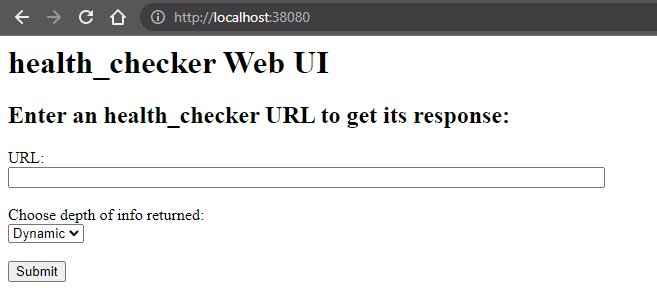
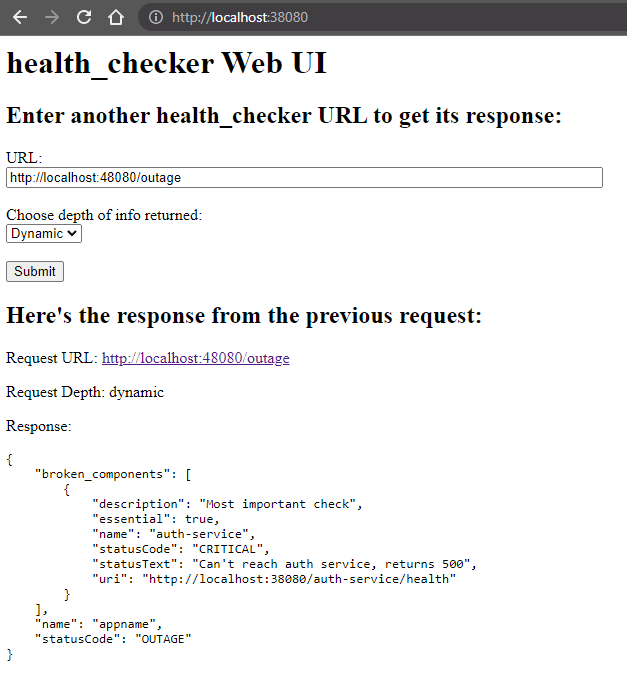

# Health Checker

It checks health!

## What is `health_checker`?

The `health_checker` tool's main goal is to make HTTP requests to web applications, bring back the response, parse it, and pretty-print it.

The web applications are expected to respond with JSON content, and `health_checker` is capable of parsing the response JSON and displaying it in pretty-printed JSON of various lengths (dicted by its `depth` option).

It also has a web server mode where it can start up a simple HTTP server that will host a simple health checker HTML page. The page has a text box to enter the URL and a button that will perform the check and return the response to the page.

## Usage Instructions

Build it!

```bash
$ go build -o health_checker-web ./cmd/health_checker-web/web.go

$ go build -o health_checker-go ./cmd/health_checker-go/main.go

$ ls -1 | egrep health_checker
health_checker-go
health_checker-web
```

### CLI program: `health_checker-go`

Help text:

```bash
$ ./health_checker-go -help
Usage: health_checker-go [options]

  -depth string
        Determine amount/type of data to return (default "dynamic")
  -hostHeader string
        override Host specified in URL
  -url string
        url to check
```

Depth flag to control amount of detail:

```bash
$ ./health_checker-go -url "http://localhost:48080/outage" -depth short
{
    "name": "appname",
    "statusCode": "OUTAGE"
}

$ ./health_checker-go -url "http://localhost:48080/outage" -depth dynamic
{
    "broken_components": [
        {
            "description": "Most important check",
            "essential": true,
            "name": "auth-service",
            "statusCode": "CRITICAL",
            "statusText": "Can't reach auth service, returns 500",
            "uri": "http://localhost:38080/auth-service/health"
        }
    ],
    "name": "appname",
    "statusCode": "OUTAGE"
}

$ ./health_checker-go -url "http://localhost:48080/outage" -depth full
{
    "components": [
        {
            "description": "Most important check",
            "essential": true,
            "name": "auth-service",
            "statusCode": "CRITICAL",
            "statusText": "Can't reach auth service, returns 500",
            "uri": "http://localhost:38080/auth-service/health"
        },
        {
            "description": "Less important check",
            "essential": false,
            "name": "activity-webservice",
            "statusCode": "OK",
            "statusText": null,
            "uri": "http://localhost:38080/activity-service/health"
        },
        {
            "description": "Some other check",
            "essential": true,
            "name": "database",
            "statusCode": "OK",
            "statusText": null,
            "uri": "http://localhost:48080/user-table"
        }
    ],
    "name": "appname",
    "statusCode": "OUTAGE"
}
```

### Web server program: `health_checker-web`

Help text:

```bash
$ ./health_checker-web -help
Usage: health_checker-web [options]

  -port string
        Port to run the local web server (default "8080")
```

Run the server (with optional port specification):

```bash
$ ./health_checker-web -port 38080
```

Web server displays basic page to enter URL and optionally specify depth:



Enter a URL and click Submit to get back the response:



Terminal outputs the results from the web UI:

```bash
$ ./health_checker-web -port 38080
Request URL: http://localhost:48080/outage
Request Depth: dynamic
Response: {
    "broken_components": [
        {
            "description": "Most important check",
            "essential": true,
            "name": "auth-service",
            "statusCode": "CRITICAL",
            "statusText": "Can't reach auth service, returns 500",
            "uri": "http://localhost:38080/auth-service/health"
        }
    ],
    "name": "appname",
    "statusCode": "OUTAGE"
}
```
